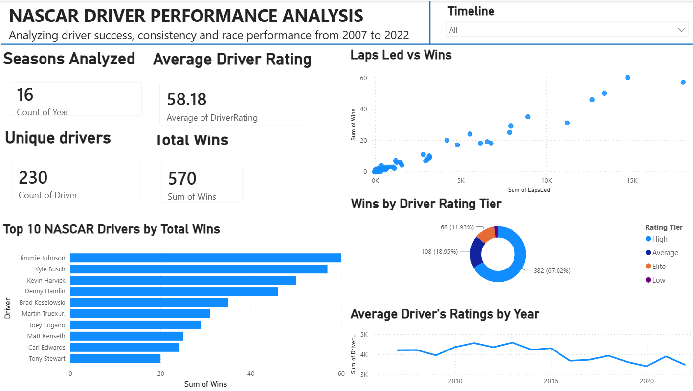

# NASCAR Driver Analysis

  

## Project Overview
This project analyzes NASCAR driver statistics to explore performance patterns, driver rankings, and trends across the available racing data.

The project combines Python-based data analysis with an interactive Power BI dashboard to transform raw NASCAR data into meaningful insights and visualizations.

## Project Objectives

- Analyze NASCAR driver performance and statistics
- Clean and prepare the raw dataset for analysis
- Identify patterns and trends in driver performance
- Compare drivers using key performance metrics
- Build an interactive dashboard for exploring the data

## Dataset
The project uses NASCAR driver statistics containing information related to driver performance.
The data is organized into:

- **Raw data**: the original dataset
- **Cleaned data**: the processed dataset used for analysis

## Data Preparation
The dataset was prepared using Python and Jupyter Notebook.

The preparation process included:

- Inspecting the dataset
- Checking for missing values
- Cleaning and formatting the data
- Removing unnecessary or duplicate data where needed
- Preparing the cleaned dataset for visualization and analysis

## Python Analysis
The data analysis was performed using Python in Jupyter Notebook.

The notebook contains the analysis and processing steps used to explore the NASCAR dataset and prepare it for visualization.

## Power BI Dashboard
An interactive Power BI dashboard was created to visualize the NASCAR data and make the analysis easier to explore.

The dashboard allows users to investigate driver performance and explore the data across different time periods.

### Timeline
The dashboard includes a timeline filter that allows users to select the time period they want to explore.

## Key Insights
The analysis focuses on identifying:

- Differences in driver performance
- Top-performing drivers
- Performance patterns across different periods
- Trends in NASCAR driver statistics

## Tools & Technologies

- Python
- Pandas
- Jupyter Notebook
- Power BI
- DAX
- Git & GitHub

## Project Structure

NASCAR-Data-Analysis/
│
├── data/
│   ├── raw/
│   │   └── nascar_driver_statistics.csv
│   │
│   └── cleaned/
│       └── nascar_cleaned.csv
│
├── notebooks/
│   └── nascar_analysis.ipynb
│
├── powerbi/
│   └── NASCAR_Dashboard.pbix
│
└── README.md

## Project Outcome
The final result is an end-to-end data analysis project that transforms NASCAR driver data into an interactive Power BI dashboard supported by Python-based data preparation and analysis.
